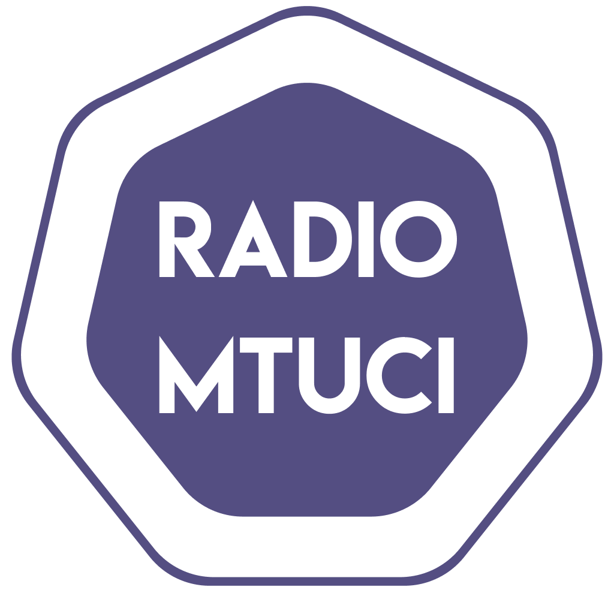

# Radio MTUCI

We are the student radio station of the Moscow Technical University of Communications and Informatics, run exclusively by students!

Yes, we are not professionals! But we strive to make every one of our broadcasts not only entertaining but also educational! Tune in for tech world news, complex topics explained simply, podcasts with interesting guests, nighttime plays, engaging shows, and much more!

No politics! No advertising! Just music, great programs, and good vibes!

## Legal Information
The mass media outlet "Radio MTUCI" was registered on August 15, 2019, in the form of a "radio channel." Registration Certificate El No. FS77-76376 issued on August 15, 2019, by the Federal Service for Supervision of Communications, Information Technology, and Mass Media (Roskomnadzor). For listeners aged 16 and over. © All rights reserved. Reprinting and copying of any content from the site is permitted only with written consent.
