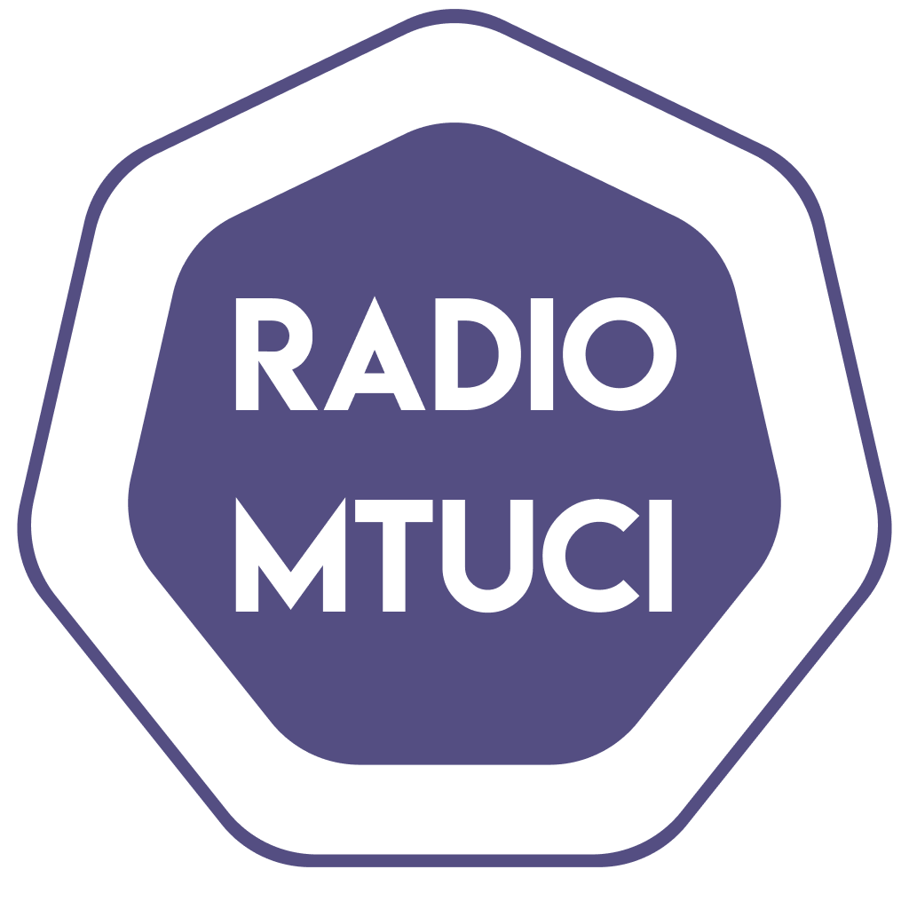

[ENG](../README-END.md)
# Радио МТУСИ

Мы – студенческая радиостанция Московского Технического Университета Связи и Информатики, на которой работают исключительно студенты! 

Да, мы не профессионалы! Но мы стараемся сделать так, чтобы каждый наш эфир был не только развлекательным, но ещё и познавательным! Слушайте новости мира технологий, простыми словами о сложном, подкасты с интересными гостями, ночные спектакли, интересные шоу и многое другое! 

Никакой политики! Никакой рекламы! 
Только музыка, крутые программы и хорошее настроение!

## При разработке используются

## Правовая информация

Средство массовой информации «Радио МТУСИ» зарегистрировано 15 августа 2019 года в форме распространения “радиоканал”. Свидетельство Эл № ФС77-76376 от 15.08.2019 
выдана федеральной службой по надзору в сфере связи, информационных технологий и массовых коммуникаций (Роскомнадзор). Для слушателей старше 16 лет.
© Все права защищены. Перепечатка и копирование любого содержания сайта разрешается только с письменного согласия.
